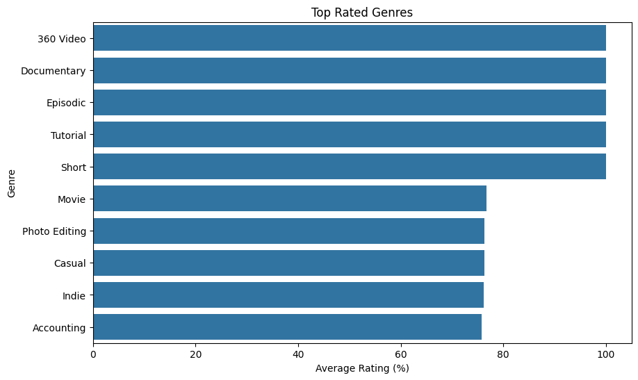
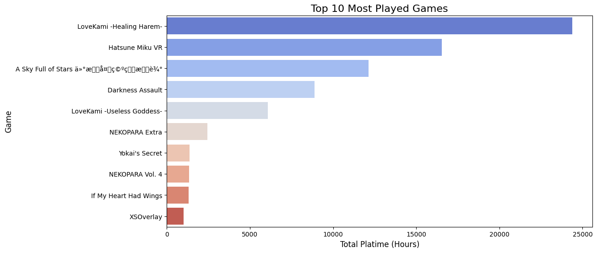

# 📊 Steam Games Data Analysis
Steam Games Data Analysis using Python (Pandas &amp; Seaborn)

This project analyzes Steam game data to uncover insights about player behavior, genre popularity, and player engagement.

---

## 🔧 Tools Used
- Python
- Pandas
- Seaborn
- Matplotlib
- Jupyter Notebook

---

## 📈 Key Features
- Data cleaning and preprocessing
- Custom rating calculation using user reviews
- Top-rated genres analysis
- Most played games visualization

---

## 📊 Visualizations

### 🎮 Top Rated Genres

### 🕹️ Most Played Games

---

## 💡 Key Insights
- Some genres show perfect ratings due to low sample sizes
- A small number of games dominate total playtime
- Data cleaning was required to handle missing values and formatting issues
- Encoding issues in game titles were identified and handled

---

## 📁 Files Included
- `steam_analysis.ipynb` → Data cleaning and analysis
- `steam_cleaned.csv` → Clean dataset
- `images/` → Visualizations

---

## 🚀 How to Run
1. Open the notebook in Jupyter Notebook or Google Colab
2. Run all cells
3. View the generated charts

---

## 📌 Author
Anuja
